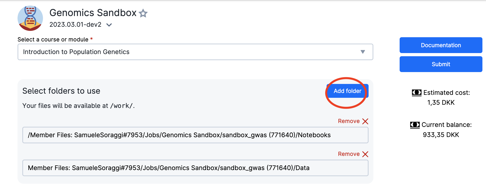
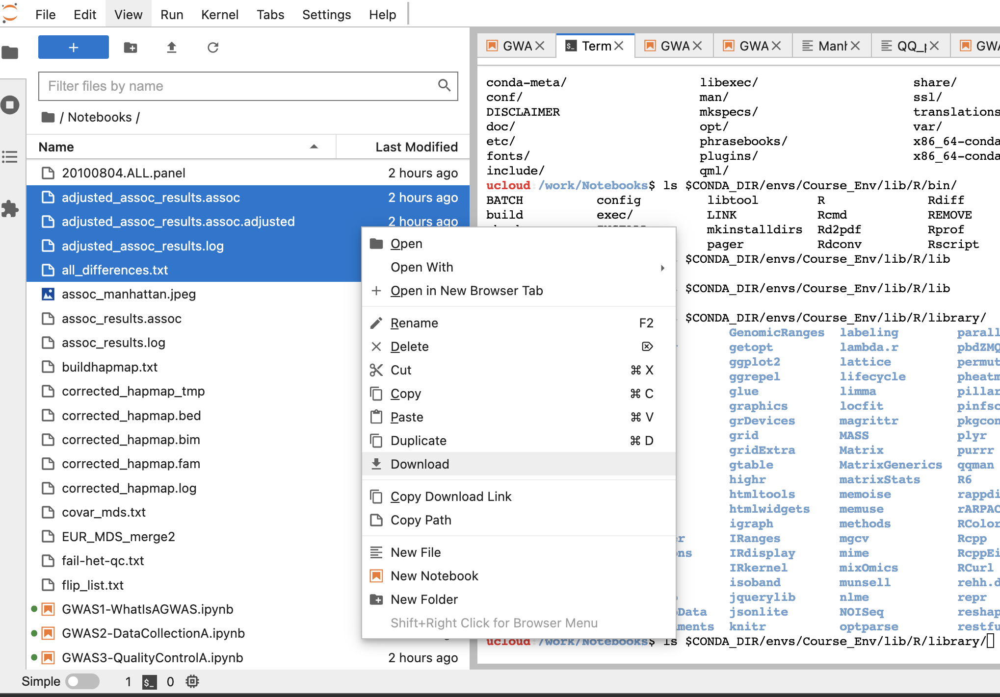

# UCloud 

[UCloud](https://cloud.sdu.dk) is an HPC platform available to researchers and students at Danish universities (via a WAYF university login). It features a user-friendly graphical interface that simplifies project, user, and resource management. UCloud offers access to numerous tools via selectable apps and a variety of flexible compute resources. Check out UCloud’s extensive user docs [here](https://docs.cloud.sdu.dk/index.html). For a more detailed information on navigating UCloud and using our apps, check out the[Sandbox guidelines](https://hds-sandbox.github.io/access/UCloud.html).

**If you’ve chosen UCloud as your HPC platform to use the Genomics app, follow the steps below.**

### Step 1
Log onto UCloud at the address http://cloud.sdu.dk using university credentials.

### Step 2

When logged in, choose the project from the dashboard (top-right side) from which you would like to utilize compute resources. Every user has their personal workspace (`My workspace`). You can also provision your own project (check with your local DeiC office if you’re new to UCloud) or you can be invited to someone else’s project. If you’ve previously selected a project, it will be launched by default. If it’s your first time, you’ll be in your workspace. 

### Step 3

:::{.callout-warning}
# Only for participants at the workshop

If you are participating in the GWAS workshop, you need to select `Sandbox Workshop` (see image below, top-right corner). This will allow us to provide a pre-configured environment with everything you need installed, along with access to our resources.
:::

If you haven't joined our workspace yet, please click below:

&nbsp;

 

  <a href="https://cloud.sdu.dk/app/projects/invite/d68169ad-6bb1-422d-b0df-d21e2751f8fb" style="background-color: #4266A1; color: #FFFFFF; padding: 30px 20px; text-decoration: none; border-radius: 5px;">
    Invite link to
    UCloud workspace
  </a>

&nbsp;

Once you are an approved user of UCloud, you are met with a dashboard interface as below. Here you can see a **summary of the workspace** you are using, like the hours of computing, the storage available, and other details. The workspace you are working on is shown in the top-right corner (red circle). On the left side of the screen you have a toolbar menu.

### Step 4  
The left-side menu can be used to access the stored data, applications, running programs and settings. Use the **Applications** symbol (in gray). Search for the **Genomics Sandbox** application to open its settings.

### Step 5 
Choose any Job Name (#1 in the figure below), how many hours you want to use for the job (#2, choose at least 2 hours, you can increase this later), and how many CPUs (#3, choose at least 4 CPUs for the first three exercises, but use at least 8 CPUs to run the single cell analysis). Select the `Introduction to GWAS` as course (#4). Then click on `Submit` (#5). The App needs to download data and packages which can take some time. See below **how to reuse the data and avoid long waiting time** (you need however to download data the first time you run the app).

You will be waiting in a queue looking like this:

### Step 6 
As soon as there are resources, you will have them available, and in a short time the course will be ready to run. The screen you get is in the image below. Here you can increase the number of hours you want the session to run (red circle), close the session (green circle) and open the interface for coding (blue circle)

:::{.callout-tip}

Once you open the coding interface, it does not matter if you close the browser tab with the countdown timer. You can always access it again from the toolbar menu of uCloud. Simply click on `jobs` and choose your session from the list of running softwares:

:::

Now you are ready to use JupyterLab for coding. Use the file browser (on the left-side) to find the folder `Notebooks`. Select one of the four tutorials of the course. You will see that the notebook opens on the right-side pane. Read the text of the tutorial and execute each code cell starting from the first. You will see results showing up directly on the notebook!

#### Recovering the material from your previous session

It would be annoying to start from scratch at each session, with all the analysis to be executed again. You can use data and notebooks running in a previous session of the App. **Otherwise, the app will download the data and the notebooks every time**.

To choose the data from previous sessions, click on `Add folders` on the browsing bar appearing in the gray option box (red circle in the figure below). Then, find your latest session of the sandbox (inside the folder `Jobs/Genomics Sandbox` under your personal user folder as shown below) and choose the folder you need. In this example, accepted folders are `Data` and `Notebooks`.

## Download the data you generated

You can easily download files you generated by right-clicking on selected files in the browser of Jupyterlab, and by choosing download (see figure below).

