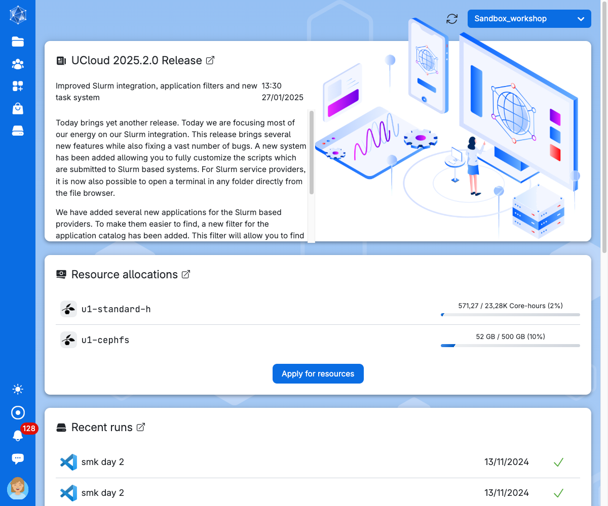
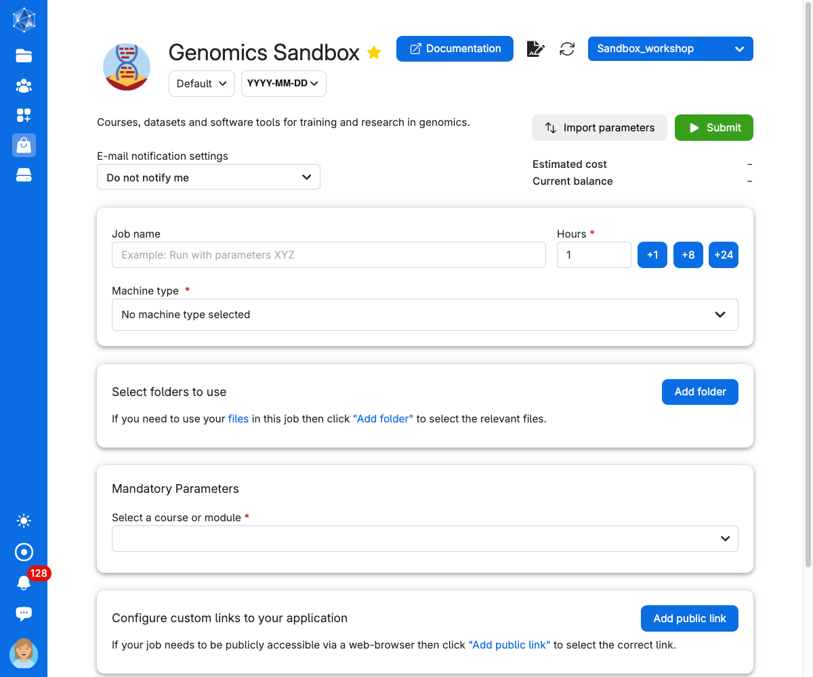

## Using UCloud 

[UCloud](https://cloud.sdu.dk) is a relatively new HPC platform accessible to all researchers and students at Danish universities (via a WAYF university login). It features a user-friendly graphical interface that simplifies project, user, and resource management. UCloud offers access to numerous tools via selectable apps and a variety of flexible compute resources. Check out UCloud’s extensive user docs [here](https://docs.cloud.sdu.dk/index.html).

If you’d like a more detailed explanation and guide on UCloud, including how to navigate and understand the dashboard better, feel free to check our guidelines on how to access our sandbox app and get started: [Sandbox guidelines](https://hds-sandbox.github.io/access/UCloud.html).

### Step 1
Log onto UCloud at the address http://cloud.sdu.dk using university credentials.

### Step 2

When logged in, choose the project from the dashboard (top-right side) from which you would like to utilize compute resources. Every user has their personal workspace (`My workspace`). You can also provision your own project (check with your local DeiC office if you’re new to UCloud) or you can be invited to someone else’s project. If you’ve previously selected a project, it will be launched by default. If it’s your first time, you’ll be in your workspace. 

### Step 3

:::{.callout-warning}
# Only for participants at the workshop

If you are participating in the GWAS workshop, you need to select `Sandbox Workshop` (see image below, top-right corner). This will allow us to provide a pre-configured environment with everything you need installed, along with access to our resources.
:::

If you haven't joined our workspace yet, please click below:

&nbsp;

 

  <a href="https://cloud.sdu.dk/app/projects/invite/d68169ad-6bb1-422d-b0df-d21e2751f8fb" style="background-color: #4266A1; color: #FFFFFF; padding: 30px 20px; text-decoration: none; border-radius: 5px;">
    Invite link to
    UCloud workspace
  </a>

&nbsp;

Once you are an approved user of UCloud, you are met with a dashboard interface as below. Here you can see a **summary of the workspace** you are using, like the hours of computing, the storage available, and other details. The workspace you are working on is shown in the top-right corner (red circle). On the left side of the screen you have a toolbar menu.

<!--
:::{.callout-warning title="Exercise: drives and file explorer"}

Click on the first button of the left menu (Files). The **Files** window will open. Here you can create **drives**, which are virtual storage units resembling the drives of a computer, where you can store, delete and move files around.

Create a drive using the button on top of the window (`Create drive`), choose the resources available from the dropdown menu (in the workspace `My workspace` you probably have `u1-cephfs`) and assign a name. 

Now you have created your drive! If you click into this, you can see new top buttons, for example to upload a file, create a folder and sync with another computer (which needs a software - click on the button to read more). When you have a drive, you can **mount** it into a software you want to use (mount means to make it available for the software to read/write from and to).

:::
-->

### Step 4  
The left-side menu can be used to access the stored data, applications, running programs and settings. Use the **Applications** symbol (in gray). Search for the **Genomics Sandbox** application to open its settings.

### Step 5 
Choose any Job Name (Nr 1 in the figure below), how many hours you want to use for the job (Nr 2, choose at least 2 hours, you can increase this later), and how many CPUs (Nr 3, choose at least 4 CPUs for the first three exercises, but use at least 8 CPUs to run the single cell analysis). Select the `Introduction to NGS Data Analysis` as course (Nr 4). Then click on `Submit` (Nr 5).

You will be waiting in a queue looking like this:

### Step 6 
As soon as there are resources, you will have them available, and in a short time the course will be ready to run. The screen you get is in the image below. Here you can increase the number of hours you want the session to run (red circle), close the session (green circle) and open the interface for coding (blue circle)

:::{.callout-tip}

Once you open the coding interface, it does not matter if you close the browser tab with the countdown timer. You can always access it again from the toolbar menu of uCloud. Simply click on `jobs` and choose your session from the list of running softwares:

:::

Now you are ready to use JupyterLab for coding. Use the file browser (on the left-side) to find the folder `Notebooks`. Select one of the four tutorials of the course. You will see that the notebook opens on the right-side pane. Read the text of the tutorial and execute each code cell starting from the first. You will see results showing up directly on the notebook!

#### Recovering the material from your previous session

It would be annoying to start from scratch at each session, with all the analysis to be executed again. You can of course find all the notebooks and results in your personal user folder in the workspace in which you are working.

To retrieve your work add the folders `Data` and `Notebooks` in the submission page of the Genomics App. Those are inside your user folder (called `member Files: NameSurname#Number`) under `Jobs/Genomics Sandbox/SessionName`. For example, look at how the `Data` folder is added from a previous session:

You need to do the same thing for the folder `Notebooks`. In the end you should have two folders added in your setup page. Now, you are set to start running the notebooks! 

